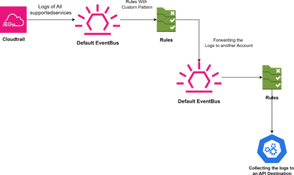

# AWS Forecast Approach

### Overview

### Prerequisites

Before you begin looking into the AWS Forecast approach in CloudLabs, ensure you have the following prerequisites:

- Admin access to [CloudLabs Admin Portal](https://admin.cloudlabs.ai/) (If access is unavailable, kindly reach out to your point of contact or [CloudLabs Support](https://docs.cloudlabs.ai/RequestSupport)).

### AWS Forecast Approach

#### Using Cross Account Event Bus as a Target in the Rules

You can send and receive events between event buses in AWS accounts within the same Region in all Regions and between accounts in different Regions as long as the destination Region is a supported cross-Region destination Region.

 

- Configuring EventBridge to send events to or receive events from an event bus in a different account include the following:
  - On the receiver account, edit the permissions on an event bus to allow specified AWS accounts, an organization, or all AWS accounts to send events to the receiver account.
  - On the sender account, set up one or more rules that have the receiver account's event bus as the target.
  - On the receiver account, set up one or more rules that match events that come from the sender account.

- Scripts:
  - Script for Deploying EventBu s rules with a Cross Account EventBus as a Target:

  - Script for Validating the creation of EventBus rules with a Cross Account EventBus as a Target:

  - Script for Deleting the created resources in EventBus: 

- PRICING
  1. EVENT BRIDGE PRICING:

     Link: https://aws.amazon.com/eventbridge/pricing/
    
     -  Event Bus:

        | Event Bus services | Cost | 
        |----------|----------|
        | 1. AWS default service events  | Free   |
        | 2. Custom events   | $1.00/million custom events published  | 
        | 3. Cross-account events   | $1.00/million events sent   |

     Size of payloads: Each 64 KB chunk of a payload is billed as one event (for example, an event with a 256 KB payload is billed as requests).

     NOTE: Events sent from one account to another are charged to the sending account as custom events. The receiving account is not charged.

  2. CLOUD TRAIL PRICING: 

     Link: https://aws.amazon.com/cloudtrail/pricing/

     -  For a free tier:
 
        | Services | Cost | 
        |----------|----------|
        | 1. Event History | CloudTrail logs management events across AWS services by default and is available for no charge. You can view, search and download the most recent 90-day history of your account’s control 	plane activity at no additional cost using CloudTrail in the CloudTrail console. You can also use the CloudTrail lookup-events API to achieve this.|
        | 2. Trails  | Creating trails allows you to deliver one copy of your ongoing management events to your Amazon Simple Storage Service (S3) bucket for free.  |  

        
     -  For a paid tier:

        | Event Bus services | Cost | 
        |----------|----------|
        | Trails  | $2.00 per 100,000 management events delivered after the first free copy.   |
      
- Resources Deployed in this Approach with their name: 

  | AWS Service Name              | Rule Name               |
  |-------------------------------|-------------------------|
  | EC2 Instance                  | ec2-instances-rule      |
  | Elastic Kubernetes Service     | eks-rule                |
  | Service Catalog               | service-catalog-rule    |
  | Relational Database Service    | rds-rule                |
  | CodeCommit                    | codecommit-rule         |
  | Simple Storage Service        | s3-rule                 |
  | Elastic Container Service      | ecs-rule                |
  | Location Service              | location-service-rule   |
  | CloudTrail                    | cloudtrail-rule         |
  | CloudWatch                    | cloudwatch-rule         |
  | CodePipeline                  | codepipeline-rule       |
  | Elastic Container Registry     | ecr-rule                |
  | Elastic LoadBalancer          | elb-rule                |
  | Glacier                       | glacier-rule            |
  | Lambda                        | lambda-rule             |

  | AWS Service        | Name                                   |
  |--------------------|----------------------------------------|
  | Event Bus          | Default                                |
  | CloudTrail Trail   | Wiz-trail                              |
  | IAM Role           | CrossAccountEventBusPutEventRole       |
  | IAM Policy         | CrossAccountEventBusPutEventRole-Policy |

- Service Wise Log Analysis: 
 
